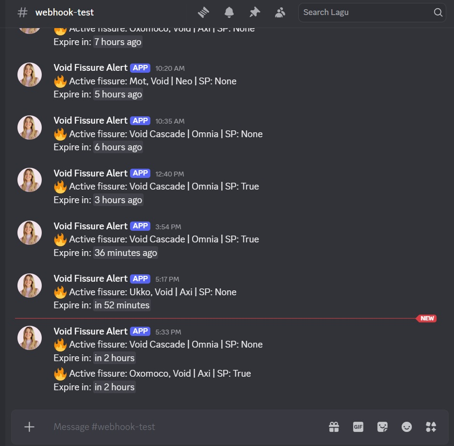

# Monitor Warframe Worldstate API and Send Alert via Discord Webhook

Create .env file containing:
DISCORD_WEBHOOK_URL = <YOUR_DISCORD_WEBHOOK_API>

<YOUR_DISCORD_WEBHOOK_API> can be found at Edit Text Channel --> Integrations --> Webhook URL (Create new if needed)

1. Clone Repo
2. Create the missing .env file
3. Setup python virtual environment (venv)
4. Active venv and install requirements.txt (inside venv)
5. Test cloud_check.py manually to see if it's working
6. Create a service file to run the cloud_check.py, make sure to run the .py inside venv/bin/
7. Reload systemd
8. Start and enable the service to enable auto-start on boot
9. Check the service logs for error if needed.

# Customizable by adding preferred SolNode from https://wiki.warframe.com/w/World_State#Node to config/tracked_missions.py
## Currently have:
1. Void Cascade
2. Hepit, Void -- Fast capture + Lith/Aya
3. Teshub, Void -- Fast exterminate + Lith/Aya
4. Ukko, Void -- Fast capture + Meso/Neo/Aya
5. Oxomoco, Void -- Fast exterminate + Meso/Neo/Aya
6. Mot, Void -- Survival | Neo/Axi/Aya
7. Belenus, Void -- Defense | Neo/Axi/Aya

# Can be deployed onto Cloud Hosted VM for 24/7 Alert

